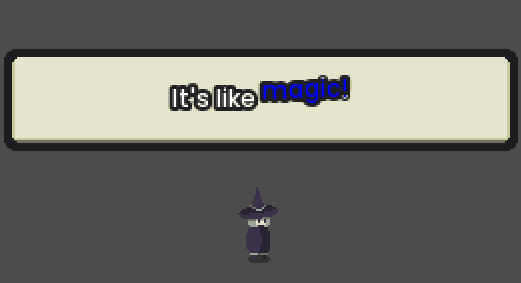

# Dialogue Plugin for Godot Engine
[]() [](https://github.com/AnidemDex/Godot-DialogPlugin/blob/main/LICENSE)
[](https://github.com/AnidemDex/Godot-DialogPlugin/issues)
[]()



An user-friendly dialog system for Godot Engine, with timelines, characters, text boxes, dialog bubbles and many more (planned) features for your games. 

> Be creative 💬

> **Note:** _If you find a bug, or want a feature to be included, feel free to [open a new issue](https://github.com/AnidemDex/Godot-DialogPlugin/issues/new). You can also send me a message on [twitter](https://twitter.com/anidemdex) or Discord (AnidemDex#6740)._

## ⚠Warning⚠

> This plugin is **not** ready for use, yet. 

You can try it anyway, but be sure to make a copy of your dialog files. The format will not change, but, just in case.

# Installation

Download the lastest release and extract the ZIP file. Move the `addons` folders to the root of your project. It's that easy!

If you want more information about installing plugins in Godot, please refer to [official documentation page](https://docs.godotengine.org/en/stable/tutorials/plugins/editor/installing_plugins.html).

# How to use it

That's a good question.

1. First, create a timeline, inside the Dialog Editor tab.
   
   After activating the plugin, go to Dialog Editor tab. It should be next to `AssetLib` tab.
   

   Then, click on `Timelines` button and `New` button.
   

2. Add some events to that timeline. A timeline without events will not work, and will halt your game if you try to use it.
   
   
3. Create a new `Dialog` node, and `start` it with your recently created timeline.
   
   You had 2 options:
   1. Create it from code:
```gdscript
# ...
# inside any node in the scene
# ...

# Create the node first and start it with your timeline
var dialog_node = Dialog.start(<your_timeline>)

# Add that node to the scene
add_child(dialog_node)
```
`your_timeline` can be the name of your timeline (the name that you used when you created it), the absolute path to that timeline or a `DialogTimelineResource`.

   2. or Instantiate it in the scene editor:
   

Then, select the node:


And, inside the Inspector tab, select the timeline:


That's it, it's fair simple.

> For now, there's only 3 events. They'll be more, and you can create your custom events if you want.

# Documentation

Please refer to [DOCS.md](/docs/DOCS.md) (WIP)
