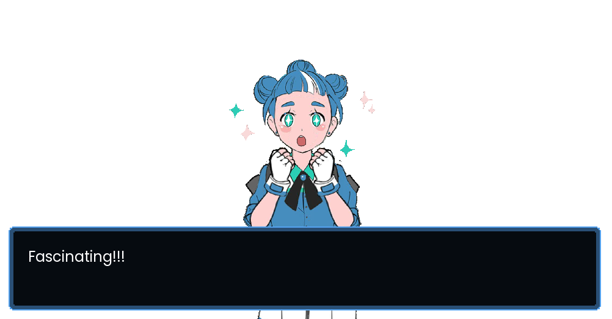

# Textalog - A DialogSystem Plugin for Godot Engine
[]() [](https://github.com/AnidemDex/Godot-DialogPlugin/blob/main/LICENSE)
[](https://github.com/AnidemDex/Godot-DialogPlugin/issues)
[](https://github.com/AnidemDex/Godot-DialogPlugin/releases/tag/v1.0)

<p align="center">
  <a href="https://twitter.com/anidemdex" target="_blank"></a><br/>
  Twitter: <a href="https://twitter.com/anidemdex" target="_blank">@AnidemDex</a>
</p>

An user-friendly dialog system for Godot Engine with characters, text boxes, dialog bubbles and many more (planned) features for your games. 

> **Note:** _If you find a bug, or want a feature to be included, feel free to [open a new issue](https://github.com/AnidemDex/Godot-DialogPlugin/issues/new). You can also send me a message on [twitter](https://twitter.com/anidemdex) or [join us on Discord](https://discord.gg/83YgrKgSZX)._


## Features
### 🪧 DialogNode and 🗨️ DialogBubble
A node implementation for dialog box and dialog bubble, fully customizable and build with common dialog commands to improve your game development in the dialogue interaction.

- DialogNode


- DialogBubble
<p align="center">
  
</p>

### 🐱‍👤 Characters and 🖼️ Portraits
Characters are data containers to describe what expressions (portraits) are going to be used in dialogue and what properties of the dialogue will be overriden during the gameplay.

<!--TODO: Add an image here-->
## 🚩 Installation

Download the lastest release and extract the ZIP file. Move the `addons` folders to the root of your project. It's that easy!

> You can take a look in a more detailed tutorial in the [plugin's documentation](https://godotplugins.gitbook.io/textalog/getting-started/installation).

If you want more information about installing plugins in Godot, please refer to [official documentation page](https://docs.godotengine.org/en/stable/tutorials/plugins/editor/installing_plugins.html).

If you're downloading the repository instead, make sure to move only `textalog` to your `addons` folder. Extra files and folders are for debug purposes.

## 🧵 Usage
Quick example to try the most simple functionality: showing text on the screen.
```gdscript
func _ready() -> void:
  # Creates a new DialogNode instance
  var dialog_node = DialogNode.instance()

  # Add the node as child
  add_child(dialog_node)

  # Shows the dialog node
  dialog_node.show()

  # Show an string. BBCode works too!
  dialog_node.show_text("Hello world!")
```

## 🔎 What is new on this version? [1.0]

This is the first stable release _(yay 🥳)_. To manage to release this, many things were removed to add them later on 1.x versions (like, the timelines).

* Added:
  * **`DialogNode` node class**
  * **`DialogBubble` node class**
  * **`PortraitManager` node class**
  * **`DialogManager` node class**
  * **`OptionManager` node class**
  * **`Portrait` resource class**
  * **`Character` resource class**
  * **DialogNode customization through themes**
* Removed:
  * **Literally everything from `dialog_plugin` folder**. Take a look on previous pre-release versions to see what exactly were removed. Those features will be reimplemented in future minor versions.


Want to see the whole changelog? Take a look on the documentation, the [Changelog](https://anidemdex.gitbook.io/godot-dialog-plugin/changelog) section.

## 📚 Documentation

Now we have an official documentation! All the information about the plugin you will find it organized in the [documentation page](https://anidemdex.gitbook.io/godot-dialog-plugin/). Tutorials, class information, FAQ and more will be added there, eventually.

## 📝Credits and license
Made by [AnidemDex](https://github.com/anidemDex)

This plugin uses [MIT license](./LICENSE)
