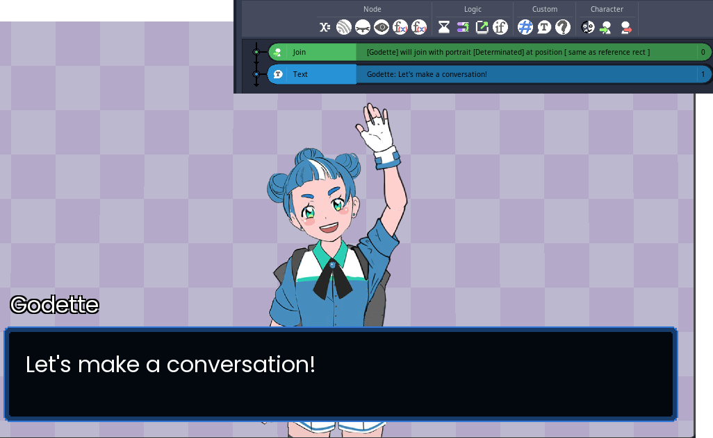
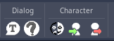

# Using Textalog as Dialog System

In order to use Textalog as a Dialog System you must had EventSystem plugin installed.

The installation process can be readed on the [installation guide of EventSystem documentation](https://godotplugins.gitbook.io/eventsystem/getting-started/installing-the-plugin).


Since Textalog 1.1, EventSystem is included in the repository, and an additional release file includes the EventSystem plugin.
EventSystem is not included in the download from AssetLib or the ZIP generated by the repository download button.


Textalog adds some events to EventSystem editor:

- **Dialog**
  - **Text**: Displays text in the DialogNode
  - **Choice**: Adds choices to the screen through OptionManager and let you create subtimelines for those options
- **Character**
  - **Join**: A character portrait will be added to the scene
  - **Leave**: A character will be removed from scene
  - **Change Expression**: A character that's already in scene will change its portrait to another portrait.
